## **UNIVERSITÀ DEGLI STUDI DELL'INSUBRIA**

DIPARTIMENTO DI SCIENZE TEORICHE E APPLICATE

#### CORSO DI STUDIO TRIENNALE IN **INFORMATICA**

# **Esplorazione dei confini decisionali per il Machine Learning avversario utilizzando l'Adaptive Multi-Scale Boundary Explorer AMBE**

**Relatore:**

Prof.ssa Alessandra Rizzardi

**Co-relatore:**

Dr. Jesùs F. Cevallos Moreno

**Tesi di Laurea di:**

Bechari Ayoub Matricola 751098

**Anno accademico:**

2024/2025

# **Indice**

| Capitolo 1 - Introduzione<br>1                                           |      |
|--------------------------------------------------------------------------|------|
|                                                                          |      |
| Capitolo 2 - Stato dell'arte<br>4                                        |      |
| 2.1 Modelli di apprendimento automatico e gradiente<br>4                 |      |
| 2.2 Tassonomia degli attacchi adversariali<br>7                          |      |
| 2.3 Obiettivo dell'attacco9                                              |      |
| 2.4 Tempistica e fase di attacco<br>10                                   |      |
| 2.5 Adattamento a dati industriali (IIoT)<br>11                          |      |
| 2.6 Tendenze emergenti<br>12                                             |      |
|                                                                          |      |
| Capitolo 3 - Progettazione dell'algoritmo<br>14                          |      |
| 3.1 Introduzione<br>14                                                   |      |
| 3.2 Formulazione matematica del problema di esplorazione<br>15           |      |
| 3.3 Architettura AMBE<br>16                                              |      |
| Modulo di query e controllo del modello<br>17                            |      |
| Modulo di raffinamento e recupero della frontiera19                      |      |
| Modulo di esplorazione direzionale PCA-based<br>24                       |      |
| Rappresentazione logica<br>28                                            |      |
| Capitolo 4 - Test e valutazione<br>30                                    |      |
| 4.1 Generazione del dataset sintetico e modello target<br>31             |      |
| 4.2 Analisi dell'efficienza nella ricerca della frontiera<br>36          |      |
| 4.3 Adattività dell'esplorazione e robustezza del meccanismo di recovery | . 39 |
| 4.4 Validazione quantitativa della copertura della frontiera<br>40       |      |
| 4.5 Benchmark comparativo di sintesi<br>40                               |      |

51

| Capitolo 5 - Conclusioni<br>43             |
|--------------------------------------------|
| 5.1 Sintesi dei risultati<br>43            |
| 5.2 Possibili implementazioni future<br>44 |
|                                            |
|                                            |
| Bibliografia<br>46                         |

# **Introduzione**

I sistemi *Industrial Internet of Things (IIoT)* si basano su modelli di apprendimento automatico per analizzare i grandi volumi di dati provenienti da sensori generati da asset industriali interconnessi. Manometri, sonde di temperatura, sensori di vibrazione e logiche di controllo formano collettivamente un dataset strutturato ad alta dimensionalità che riflette il comportamento reale di macchinari, linee di produzione e infrastrutture critiche. Questi modelli sono utilizzati per il rilevamento di anomalie, la manutenzione predittiva e l'ottimizzazione dei processi, dove una singola errata classificazione può tradursi in costosi tempi di fermo o condizioni operative non sicure.

Tuttavia, con l'integrazione sempre più profonda del machine learning nei flussi di lavoro industriali, sono emersi nuovi rischi per la cybersecurity. Tra i più critici vi sono gli *attacchi adversariali*, piccole perturbazioni accuratamente progettate applicate ai dati di input che causano al modello di produrre previsioni errate pur apparendo innocue per gli operatori umani. Tali attacchi espongono una vulnerabilità fondamentale dei sistemi decisionali basati sui dati: la loro sensibilità in prossimità della frontiera decisionale. Comprendere e caratterizzare questa frontiera è quindi essenziale per quantificare la robustezza e progettare modelli di apprendimento più sicuri.

Questa tesi si concentra sulla ricerca e l'analisi dei punti di frontiera decisionale in modelli di machine learning addestrati su dataset IIoT. A differenza dei lavori tradizionali che esplorano la robustezza adversarial nei domini di immagini o sequenze, questa ricerca considera dati IoT tabulari statici, dove ogni campione rappresenta un'istantanea del sistema piuttosto che una serie temporale.

L'obiettivo è sviluppare e valutare un algoritmo in grado di localizzare efficientemente punti di frontiera, input che giacciono vicini alla superficie decisionale del modello e che quindi rivelano la sua vulnerabilità a perturbazioni adversarial. L'approccio proposto, denominato *Adaptive Multi-Scale Boundary Explorer (AMBE)*, integra strategie di perturbazione multi-scala con esplorazione adattiva per mappare la geometria locale delle regioni decisionali utilizzando solo informazioni minime dal modello. In questo modo, contribuisce sia alla comprensione teorica del comportamento adversarial sia alla valutazione pratica della robustezza del modello nelle applicazioni IIoT.

Lo scopo della tesi è dimostrare che algoritmi di ricerca della frontiera come AMBE possono essere impiegati non solo per creare esempi adversarial, ma anche come strumenti analitici per caratterizzare la struttura delle frontiere decisionali in modelli IIoT black-box del mondo reale. Ciò consente una valutazione sistematica della robustezza senza richiedere gradienti interni o accesso al modello, supportando un approccio *security-by-design* nei sistemi di intelligenza artificiale industriale.

#### **Contributi della tesi**

I contributi di questa tesi si articolano in tre punti:

- 1. Lo sviluppo di un algoritmo adattivo di ricerca della frontiera multi-scala specifico per dataset IoT statici;
- 2. Un framework di benchmarking che misura la robustezza del modello attraverso metriche di prossimità, efficienza delle perturbazioni e stima della densità di frontiera;
- 3. Uno studio sperimentale su modelli di classificazione IIoT rappresentativi e dataset, dimostrando come l'analisi della frontiera possa rivelare regioni di vulnerabilità e guidare strategie di difesa come l'addestramento adversarial o la calibrazione dell'incertezza.

### **Struttura della tesi**

- **Capitolo 1 Introduzione.** Introduce il contesto applicativo della cybersecurity industriale e della manutenzione predittiva in ambito IIoT, definendo le motivazioni del lavoro, gli obiettivi di ricerca e il contributo proposto.
- **Capitolo 2 Stato dell'Arte.** Presenta una revisione critica dei principali contributi in ambito adversarial machine learning, con particolare at-

tenzione agli attacchi black-box, ai metodi di esplorazione della frontiera decisionale e alla loro rilevanza per i sistemi IIoT.

- **Capitolo 3 Progettazione dell'Algoritmo.** Descrive l'*Adaptive Multi-Scale Boundary Explorer (AMBE)*, illustrandone i principi di funzionamento, la formulazione matematica e le euristiche adottate per l'esplorazione adattiva della frontiera.
- **Capitolo 4 Test e Valutazione.** Illustra il framework sperimentale, i dataset e i modelli utilizzati, analizzando i risultati ottenuti e discutendo il comportamento di AMBE, le sue prestazioni, le limitazioni e i compromessi emersi nei diversi scenari di test.
- **Capitolo 5 Conclusioni e Sviluppi Futuri.** Riassume i risultati principali e propone possibili estensioni future, tra cui l'applicazione a dati IIoT temporali e l'integrazione con framework di difesa avanzati.

# **Capitolo 2**

# **Stato dell'arte**

Questo capitolo fornisce le basi teoriche e metodologiche necessarie per comprendere il lavoro svolto in questa tesi. Vengono introdotti i concetti fondamentali dell'apprendimento automatico adversariale, con particolare attenzione alla definizione di perturbazione adversariale, alla tassonomia degli attacchi e al ruolo delle frontiere decisionali nei modelli di apprendimento automatico.

# **2.1 Modelli di apprendimento automatico e gradiente**

I modelli di apprendimento automatico rappresentano la base teorica su cui si fondano gli studi sugli attacchi adversariali e sulla ricerca dei punti di frontiera nei classificatori complessi.

### **Introduzione ai modelli di apprendimento automatico**

Un modello di apprendimento automatico (*Machine Learning*, ML) ha l'obiettivo di apprendere una relazione funzionale tra un vettore di input *x* e una variabile di output *y*, costruendo una funzione *fθ*(*x*) parametrizzata da un insieme di pesi *θ*. Durante la fase di addestramento, il modello viene ottimizzato minimizzando una funzione di perdita *L*(*y, fθ*(*x*)), che misura la discrepanza tra le predizioni del modello e i valori reali osservati. Il processo di apprendimento consiste quindi nella determinazione dei parametri ottimali *θ* ∗ , definiti come

$$\theta^* = \arg\min_{\theta} L(y, f_{\theta}(x)). \tag{2.1}$$

#### **La funzione di perdita**

La funzione di perdita rappresenta il criterio attraverso cui il modello valuta la qualità delle proprie previsioni.

Nei problemi di classificazione, si utilizza spesso l'entropia incrociata, che penalizza le predizioni errate in modo proporzionale alla loro distanza probabilistica. Nei problemi di regressione, la perdita più comune è l'errore quadratico medio (MSE), che misura la deviazione media al quadrato tra valori reali e predetti.

In entrambi i casi, minimizzare la funzione di perdita significa migliorare la capacità predittiva del modello.

### **Il ruolo del gradiente**

Il gradiente rappresenta il vettore che descrive la direzione e l'intensità della variazione della funzione di perdita rispetto ai parametri del modello. In particolare, il gradiente della perdita rispetto ai parametri *θ*, indicato con ∇*θL*(*y, fθ*(*x*)), misura come una variazione infinitesima dei parametri influenzi il valore della funzione di perdita, fornendo un'informazione locale fondamentale per l'ottimizzazione.

La procedura di apprendimento si basa sul metodo della *discesa del gradiente* (*Gradient Descent*) [1], in cui i parametri del modello vengono aggiornati iterativamente nella direzione opposta a quella del gradiente, con l'obiettivo di ridurre progressivamente il valore della funzione di perdita. L'aggiornamento dei parametri avviene secondo la relazione

$$\theta_{t+1} = \theta_t - \eta \nabla_{\theta} L, \tag{2.2}$$

dove *θ<sup>t</sup>* rappresenta il vettore dei parametri all'iterazione *t*, *θt*+1 i parametri aggiornati all'iterazione successiva e *η* il *learning rate*, ossia il tasso di apprendimento che controlla l'ampiezza del passo effettuato nella direzione di discesa. Il valore del learning rate riveste un ruolo cruciale nel processo di ottimizzazione, poiché influisce direttamente sulla velocità di convergenza e sulla stabilità dell'addestramento.

Questa tecnica costituisce il fondamento dell'addestramento di reti neurali, modelli lineari e, più in generale, della maggior parte degli algoritmi di apprendimento automatico moderni.

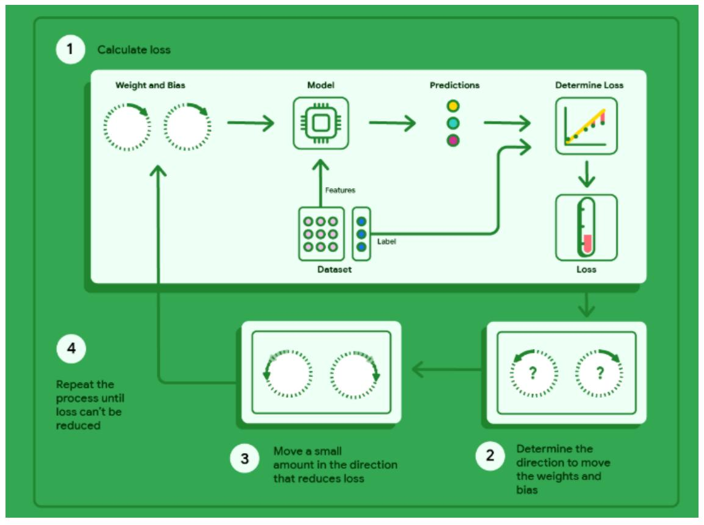

Figura 2.1: Visualizzazione del processo di discesa del gradiente: i parametri vengono aggiornati iterativamente nella direzione opposta al gradiente fino a raggiungere un minimo della funzione di perdita.

#### **Gradiente e attacchi adversariali**

Negli attacchi adversariali [2], il gradiente viene utilizzato con un obiettivo opposto: invece di aggiornare i parametri del modello, si perturba l'input *x* per massimizzare la funzione di perdita e indurre il modello in errore. In questo modo, il gradiente non serve più per migliorare il modello, ma per esplorare le sue vulnerabilità attraverso la ricerca di input perturbati che causano predizioni errate pur rimanendo visivamente o semanticamente simili agli input originali.

### **2.2 Tassonomia degli attacchi adversariali**

Gli attacchi adversariali possono essere classificati secondo diverse dimensioni [3], ognuna delle quali cattura aspetti fondamentali per la comprensione delle minacce e la progettazione di contromisure.

**Attacchi White Box** Negli attacchi *white box*, l'attaccante ha una conoscenza completa del modello (architettura, parametri/pesi, dati di addestramento) e utilizza queste informazioni per generare perturbazioni ottimali.

- **FGSM (***Fast Gradient Sign Method***)** [4]: È un metodo rapido che calcola il gradiente della funzione di perdita del modello rispetto al dato di input. Applica una perturbazione al dato originale spostando ogni pixel in una piccola quantità fissa (*ϵ*) nella direzione del gradiente (il "segno" del gradiente) per massimizzare l'errore di classificazione. L'obiettivo è ingannare il modello con il minimo calcolo possibile.
- **PGD (***Projected Gradient Descent***)** [5]: Spesso considerato una versione più robusta e iterativa di FGSM. PGD applica ripetutamente piccoli passi di gradiente per allontanarsi dalla classificazione corretta, ma "proietta" l'esempio avversariale in un intorno (spazio di perturbazione) al dato originale per mantenere le modifiche impercettibili. È molto efficace nel trovare esempi avversariali che resistono a molte difese.
- **C&W (***Carlini & Wagner***)** [6]: Questo algoritmo più avanzato mira a creare la perturbazione più piccola possibile che garantisca che il modello classifichi l'input in modo errato con alta confidenza. Utilizza una funzione di perdita ottimizzata e una ricerca binaria per trovare il valore di perturbazione ottimale, rendendo gli esempi generati molto difficili da rilevare visivamente.

**Attacchi Black Box** Negli attacchi *black box*, l'attaccante non ha accesso all'architettura o ai pesi del modello, può solo interagire con esso inviando input e osservando gli output (come la classe predetta o un punteggio di confidenza).

• **Basati sulla Trasferibilità (***Transferability-based Attacks***)** [7]: Si sfrutta il fatto che gli esempi avversariali generati per un modello (modello "surrogato" o "*proxy*"), spesso più semplice o accessibile, funzionano anche su un altro modello sconosciuto a causa della somiglianza nelle funzioni di decisione tra i modelli. L'attaccante allena un modello locale, genera attacchi *white box* su di esso e li applica al modello target *black box*.

- *Query-based Methods* **(es. Modello di Sostituzione/Clonazione)** [8]: L'attaccante interroga ripetutamente il modello target *black box* per raccogliere coppie input/output. Utilizza quindi questi dati per addestrare un proprio modello locale che imita il comportamento del target (modello di sostituzione). Una volta ottenuto un buon modello surrogato, l'attaccante può utilizzare attacchi *white box* su questo modello e trasferire gli esempi avversariali al target originale.
- **Ottimizzazione Senza Gradiente (***Gradient-free Optimization***)** [9]: Metodi che esplorano lo spazio degli input in modo iterativo, come l'approccio basato sul *random walk*. Questi algoritmi non utilizzano i gradienti, ma si basano sul feedback del modello (ad es. se la probabilità della classe corretta è diminuita) per guidare le successive perturbazioni, utilizzando euristiche o ottimizzazione stocastica per trovare un input efficace.

**Attacchi Gray Box** Gli attacchi *gray box* si collocano in una posizione intermedia. L'attaccante ha una conoscenza limitata del sistema, come ad esempio l'architettura di base, il tipo di algoritmo utilizzato, o l'accesso ad alcuni strati interni del modello (ma non a tutti i pesi). Spesso, gli attacchi *gray box* utilizzano una combinazione delle tecniche *black box* e *white box*.

- **Attacchi che sfruttano la Conoscenza Parziale dell'Architettura**: Se l'attaccante conosce il tipo di architettura (es. che è una ResNet) ma non i pesi specifici, può pre-addestrare una ResNet con pesi pubblici o dati simili e utilizzare i gradienti di quella rete per guidare un attacco di trasferibilità più mirato rispetto a un attacco *black box* puro.
- **Attacchi che sfruttano l'Accesso agli Output Intermedi/***Logit*: Invece di avere solo l'etichetta finale, l'attaccante potrebbe avere accesso ai "*logits*" (i punteggi non normalizzati prima dell'output finale). Avere accesso ai *logits* offre un segnale di gradiente più ricco rispetto alla sola etichetta binaria di classificazione, permettendo l'uso di algoritmi simili

a quelli *white box* che ottimizzano direttamente verso un output *logit* desiderato.

• **Attacchi Basati sull'Inferenza dei Parametri (***Parameter Inference Attacks***)**: In alcuni rari casi, l'attaccante può tentare di inferire parametri chiave o gli iperparametri del modello attraverso query e analisi statistiche, trasformando poi l'attacco in un approccio più vicino al *white box* man mano che si ottengono più informazioni.

### **2.3 Obiettivo dell'attacco**

L'obiettivo dell'attacco determina il comportamento che l'avversario vuole indurre nel modello target. La distinzione principale riguarda gli attacchi mirati (*targeted*) e non mirati (*untargeted*) [10].

Negli **attacchi mirati**, l'avversario cerca di far classificare l'input perturbato come una classe specifica *t* ̸= *f*(*x*), dove *f*(*x*) è la predizione originale. Formalmente: *f*(*x* ′ ) = *t*. Questa tipologia è più complessa da realizzare poiché lo spazio delle soluzioni è limitato a una singola classe target, ma risulta particolarmente pericolosa in contesti critici come l'IIoT, dove un attaccante potrebbe voler mascherare anomalie facendole classificare come operazioni normali.

Negli **attacchi non mirati**, invece, l'obiettivo è semplicemente causare una misclassificazione, indipendentemente dalla classe finale: *f*(*x* ′ ) ̸= *f*(*x*). Questa categoria è generalmente più semplice da implementare, richiedendo solo il superamento della frontiera decisionale senza vincoli sulla destinazione.


Figura 2.2: Tassonomia degli attacchi adversariali

### **2.4 Tempistica e fase di attacco**

Un'ulteriore distinzione rilevante riguarda il momento in cui l'attacco viene eseguito [11]. Gli *evasion attacks* avvengono durante la fase operativa del modello: l'attaccante modifica gli input forniti al sistema già addestrato per indurlo in errore senza alterarne i parametri interni. Rappresentano la minaccia più comune negli scenari IIoT operativi.

I *poisoning attacks* (o attacchi a tempo di addestramento) intervengono invece durante la fase di training, manipolando i dati o i processi di ottimizzazione per compromettere il modello fin dalla sua costruzione. Formalmente: *D*′ = *D* ∪ {(*x<sup>i</sup>* + *δ<sup>i</sup> , y*′ *i* )}, dove *D* è il dataset originale e *D*′ quello contaminato. Questi attacchi sono particolarmente insidiosi in ambito industriale, dove i dati di training possono provenire da fonti distribuite e non sempre affidabili.

### **2.5 Adattamento a dati industriali (IIoT)**

Nel panorama dello stato dell'arte sulla sicurezza dei modelli di machine learning, questa ricerca si concentra specificamente sul dominio Industrial Internet of Things (IIoT) [12]. L'analisi investiga le peculiarità di questo contesto, dove i vincoli fisici dei processi, la natura temporale dei dati sensoriali e i criteri di sicurezza operativa richiedono un ripensamento delle metodologie di valutazione della robustezza. Particolare attenzione è dedicata a come queste caratteristiche influenzino l'applicabilità e l'efficacia delle tecniche di ricerca dei punti di frontiera.

#### **Serie temporali**

L'analisi delle serie temporali in contesti industriali richiede un approccio specifico che tenga conto della natura sequenziale dei dati. Il primo passo consiste nell'identificazione di pattern temporali, quali sequenze di vibrazioni, temperature o consumi energetici che si trovano in prossimità del confine decisionale del modello. Questa fase è cruciale poiché permette di individuare le condizioni operative critiche in cui il sistema è più vulnerabile. Successivamente, vengono applicate perturbazioni che preservano le correlazioni temporali naturali dei dati [13]: ad esempio, è possibile modificare una finestra temporale specifica senza alterare il trend generale della serie, mantenendo così la plausibilità fisica della perturbazione. Infine, si verifica se la serie perturbata riesce a superare la frontiera di classificazione, inducendo il modello a cambiare la propria predizione da "normale" ad "anomalo" o viceversa. Questa metodologia è particolarmente rilevante nei sistemi di manutenzione predittiva, dove un attacco potrebbe mascherare segnali di guasto imminente.

#### **Requisiti operativi e vincoli del dominio industriale**

L'efficacia di un'esplorazione della frontiera in ambito industriale non può essere valutata esclusivamente in termini di accuratezza matematica, ma deve rispondere a specifici vincoli operativi. La robustezza di un modello in questo contesto viene definita innanzitutto dal **tasso di successo** nel rilevare punti di vulnerabilità lungo la frontiera decisionale [14]. Tuttavia, l'identificazione di tali punti deve avvenire nel rispetto di criteri di **efficienza e discrezione**. Negli attacchi di tipo *black-box*, il numero di interrogazioni (query) inviate al modello rappresenta un fattore critico poiché un volume elevato di richieste potrebbe innescare sistemi di rilevamento delle intrusioni o saturare la larghezza di banda dei dispositivi IIoT [14].

Un altro pilastro fondamentale per l'adattamento ai sistemi critici riguarda la **qualità della perturbazione**. Questa non rappresenta solo una distanza geometrica tra l'input originale e il punto di frontiera trovato, ma riflette la fattibilità pratica di una manipolazione avversariale [14]. In tale ottica emerge il concetto di **plausibilità fisica**, per cui una perturbazione, pur essendo matematicamente efficace, deve risultare realistica rispetto alle dinamiche del processo industriale monitorato. Sebbene nel presente studio questo aspetto venga trattato in modo semplificato a causa dell'utilizzo di dataset sintetici, la sua citazione rimane essenziale per sottolineare come i limiti dei sensori e le leggi fisiche del sistema condizionino la reale pericolosità di un attacco.

L'analisi sistematica di questi fattori permette non solo di valutare la sicurezza dei sistemi critici identificando i punti deboli prima che possano essere sfruttati [17], ma fornisce anche le basi per strategie di **addestramento difensivo** necessarie per generare modelli intrinsecamente più robusti [15, 16].

### **2.6 Tendenze emergenti**

L'evoluzione delle metodologie di analisi della robustezza sta portando la ricerca verso scenari di attacco e difesa progressivamente più articolati. Una delle direzioni attuali riguarda gli **attacchi cross-domain**, in cui le vulnerabilità identificate in un particolare dominio applicativo vengono traslate per compromettere modelli che operano su tipologie di dati differenti, sfruttando il trasferimento della conoscenza tra task diversi [18].

Parallelamente, si osserva un crescente interesse per la **ricerca multi-obiettivo**. Questa tecnica mira a identificare punti di frontiera in grado di indurre in errore simultaneamente più classificatori o diverse architetture di apprendimento, evidenziando vulnerabilità strutturali comuni a più modelli [19].

Infine, nell'ambito delle strategie di protezione, si registra lo sviluppo delle cosiddette **difese geometriche**. Queste tecniche intervengono sulla configurazione della frontiera decisionale con l'obiettivo di regolarizzarne la forma, rendendola più uniforme e meno sensibile a variazioni minime dei dati di input. Tale approccio punta a mitigare l'impatto delle perturbazioni locali, incrementando la stabilità del modello rispetto a sollecitazioni esterne non previste in fase di addestramento [20].

# **Capitolo 3**

# **Progettazione dell'algoritmo**

### **3.1 Introduzione**

L'obiettivo di questo capitolo è descrivere in dettaglio l'algoritmo proposto, Adaptive Multi-Scale Boundary Explorer (AMBE), concepito per trovare punti di frontiera (decision boundary points) per poter comprendere e trovare i punti più sensibili della frontiera su cui potrà essere effettuata eventualmente una ricerca ancora più granulare, nei modelli di classificazione addestrati su dati IIoT statici.

AMBE è pensato per scenari black-box, in cui è nota solo la classe predetta e non altre informazioni come la relativa probabilità,combinando ricerca esplorativa, stime locali della direzione di modifica e strategie di campionamento adattivo per migliorare la query-efficiency e coprire la frontiera locale.

### **Obiettivi di progettazione**

- **Efficienza**: Minimizzare il numero di query necessarie
- **Completezza**: Esplorare diverse regioni dello spazio delle feature
- **Adattività**: Adattare la strategia alla geometria locale della frontiera
- **Precisione**: Localizzare accuratamente i punti di frontiera

# **3.2 Formulazione matematica del problema di esplorazione**

Prima di descrivere nel dettaglio il funzionamento dell'algoritmo AMBE, è fondamentale formalizzare l'obiettivo del framework in termini di analisi della robustezza e monitoraggio dei limiti operativi. L'obiettivo primario non è la generazione di un singolo esempio avversariale, bensì la **mappatura sistematica dei punti di transizione** tra lo stato di funzionamento nominale e lo stato di guasto del sistema.

#### **Definizione dello spazio e della frontiera**

Sia *f* : X → {0*,* 1} un classificatore binario addestrato su dati industriali, dove X ⊆ *R<sup>d</sup>* rappresenta lo spazio multidimensionale delle feature sensoriali (es. temperatura, vibrazioni, pressione).

Dato un punto di input *x* ∈ X , il modello assegna una classe *y* ∈ {0*,* 1}. Definiamo la **frontiera di decisione** B come l'ipersuperficie di separazione nello spazio delle feature in cui il modello manifesta la massima incertezza nella transizione di stato:

$$\mathcal{B} = \{ x \in \mathcal{X} \mid P(f(x) = 1) \approx 0.5 \}$$
(3.1)

In termini di manutenzione predittiva, B rappresenta l'insieme dei "punti critici" in cui il sistema si trova in un equilibrio precario tra la zona di operatività sicura e la zona di imminente failure.

### **Obiettivo dell'esplorazione adattiva**

Il problema che AMBE risolve consiste nel generare una sequenza ordinata di punti P = {*p*1*, p*2*, . . . , pn*} che descrivano la geometria della frontiera, soddisfacendo i seguenti vincoli:

• **Prossimità alla Frontiera:** Ogni punto *p<sup>i</sup>* deve trovarsi sulla superficie di separazione, ovvero *p<sup>i</sup>* ∈ B con una precisione definita da una tolleranza *ϵ*.

- **Copertura Geometrica:** L'insieme P deve distribuirsi lungo la frontiera per catturarne le non-linearità locali, mantenendo una distanza minima *δ* tra i campioni consecutivi per garantire una mappatura uniforme.
- **Efficienza Computazionale:** L'individuazione di ogni punto *p<sup>i</sup>* deve essere ottimizzata mediante l'uso di direzioni tangenti stimate, minimizzando il numero di query *Q* necessarie alla ricerca binaria.

L'algoritmo affronta questo compito attraverso una strategia a due fasi: una **localizzazione iniziale** della frontiera tramite ricerca binaria radiale e un successivo **inseguimento adattivo** che sfrutta la geometria locale (stimata tramite PCA) per muoversi lungo il confine critico in modo efficiente.

### **3.3 Architettura AMBE**

#### **Struttura generale**

L'architettura di AMBE è stata organizzata in moduli funzionali direttamente derivati dalla struttura implementativa dell'algoritmo. Il framework è costruito attorno a un ciclo iterativo di esplorazione e controllo della frontiera decisionale, supportato da tre componenti principali:

- **Modulo di query e controllo del modello.** Gestisce l'interazione con il classificatore black-box, tracciando il numero di query e mantenendo la coerenza rispetto alla classe target.
- **Modulo di ricerca del boundary.** Include i meccanismi di *Binary Search* per il raffinamento preciso del punto di frontiera e una procedura di *Random Walk* per il recupero in presenza di fallimenti locali.
- **Modulo di esplorazione direzionale PCA-based.** Utilizza l'analisi delle componenti principali sui punti di frontiera recentemente individuati per stimare la direzione tangente dominante e realizzare salti controllati lungo la superficie decisionale.

Questa scomposizione modulare consente ad AMBE di combinare esplorazione adattiva, precisione geometrica e robustezza operativa, mantenendo una struttura facilmente estendibile a spazi di dimensione superiore.

#### **Modulo di query e controllo del modello**

**Scopo:** Il modulo di Query e Controllo del Modello costituisce il livello di interfaccia fondamentale tra l'algoritmo AMBE e il classificatore black-box. Il suo obiettivo è garantire un'interazione controllata, misurabile e riproducibile con il modello di machine learning, consentendo all'algoritmo di valutare la classe associata a punti arbitrari nello spazio delle feature senza accedere a informazioni interne quali gradienti, pesi o struttura del modello.

**Contesto concettuale:** Nel paradigma di adversarial machine learning blackbox, l'unica informazione disponibile è l'output del modello per un input specifico. In questo scenario, ogni interrogazione al classificatore rappresenta una risorsa computazionale potenzialmente costosa, specialmente in contesti industriali IIoT, dove il modello può essere distribuito, protetto o soggetto a vincoli di latenza. Di conseguenza, il numero di query effettuate diventa una metrica primaria di efficienza.

Il modulo di query assolve quindi a tre funzioni principali:

- astrarre completamente il modello sottostante, rendendo AMBE indipendente dall'architettura del classificatore;
- fissare e preservare la classe di riferimento (*target class*) rispetto alla quale viene definita la frontiera decisionale;
- contabilizzare in modo rigoroso il costo computazionale dell'esplorazione.

#### **Funzionamento logico:**

- 1. L'algoritmo viene inizializzato a partire da un punto *xtarget* appartenente alla regione operativa nominale del sistema.
- 2. Una prima interrogazione al modello consente di determinare la classe di riferimento *ctarget*, che rimane invariata per l'intera durata dell'esplorazione.
- 3. Ogni successiva valutazione di un punto *x* nello spazio delle feature avviene esclusivamente tramite una funzione di predizione black-box.
- 4. A ogni chiamata di inferenza, il contatore globale delle query viene incrementato, permettendo di monitorare in tempo reale il costo dell'algoritmo.

5. Il risultato della predizione viene confrontato con *ctarget* per stabilire se il punto si trovi nella regione sicura o abbia attraversato la frontiera decisionale.

**Ruolo nel framework AMBE:** Questo modulo rappresenta un vincolo strutturale per l'intero framework. Tutti i meccanismi di esplorazione dalla ricerca binaria al random walk fino ai salti guidati da PCA — operano esclusivamente attraverso questa interfaccia. In tal modo, la valutazione dell'efficienza, espressa in *Query per Punto* (QPP), rimane indipendente dalla strategia di esplorazione adottata e direttamente confrontabile tra scenari a diversa dimensionalità.

#### **Algorithm 1** Modulo di Query e Controllo del Modello

```
Require: Modello black-box f(·), punto target xtarget
 1: query_count ← 0
 2: ctarget ← Predict(xtarget)
 3: function Predict(x)
 4: query_count ← query_count + 1
 5: return f(x)
 6: end function
 7: function CheckClass(x)
 8: c ← Predict(x)
 9: if c = ctarget then
10: return Safe
11: else
12: return Failure
13: end if
14: end function
```

#### **Modulo di raffinamento e recupero della frontiera**

#### **Ricerca Binaria sulla Frontiera Decisionale**

Nel contesto di adversarial machine learning in modalità *black-box* e mappatura frontiera decisionale, l'assenza di informazioni differenziali o strutturali sul classificatore impone l'utilizzo di strategie di ricerca basate esclusivamente sull'output discreto del modello. In questo scenario, la ricerca binaria rappresenta una soluzione naturale ed efficiente per la localizzazione accurata della frontiera decisionale, una volta individuata una coppia di punti appartenenti a classi opposte.

Il meccanismo viene attivato ogniqualvolta l'algoritmo genera un punto candidato che attraversa la frontiera di decisione, passando dalla regione di classe target a quella avversaria invece di accettare tale punto come approssimazione grezza del confine, AMBE applica una procedura di raffinamento che consente di ridurre progressivamente l'incertezza sulla posizione esatta della frontiera lungo la direzione di attraversamento.

La ricerca binaria opera quindi come un meccanismo di *boundary refinement*, trasformando una violazione di classe in un punto di frontiera ad alta precisione. Questo approccio garantisce che i punti estratti non siano semplicemente vicini al confine decisionale, ma ne rappresentino una stima accurata e riproducibile, indipendentemente dalla complessità del modello sottostante.

#### **Fondamenti matematici della ricerca binaria in spazi continui**

Formalmente, sia *xsafe* ∈ *R<sup>n</sup>* un punto correttamente classificato e sia *xf ail* ∈ *R<sup>n</sup>* un punto appartenente alla classe opposta la frontiera decisionale è garantita esistere lungo il segmento che connette i due punti, definito come

$$x(\lambda) = (1 - \lambda) x_{safe} + \lambda x_{fail}, \quad \lambda \in [0, 1].$$

La ricerca binaria consiste in un processo iterativo di valutazione del punto medio del segmento corrente, con conseguente aggiornamento dell'intervallo in funzione della classe restituita dal modello ad ogni iterazione, la lunghezza del segmento viene dimezzata, producendo una convergenza logaritmica verso il punto di separazione tra le due regioni di classe.

La complessità del metodo è pari a *O*(log<sup>2</sup> (1*/ε*)), dove *ε* rappresenta la precisione desiderata sulla posizione del confine. Tale complessità è indipendente dalla dimensionalità dello spazio delle feature, rendendo la ricerca binaria particolarmente adatta a scenari ad alta dimensione inoltre, il metodo presenta un'elevata stabilità numerica, poiché si basa esclusivamente su operazioni di interpolazione lineare e valutazioni discrete del classificatore.

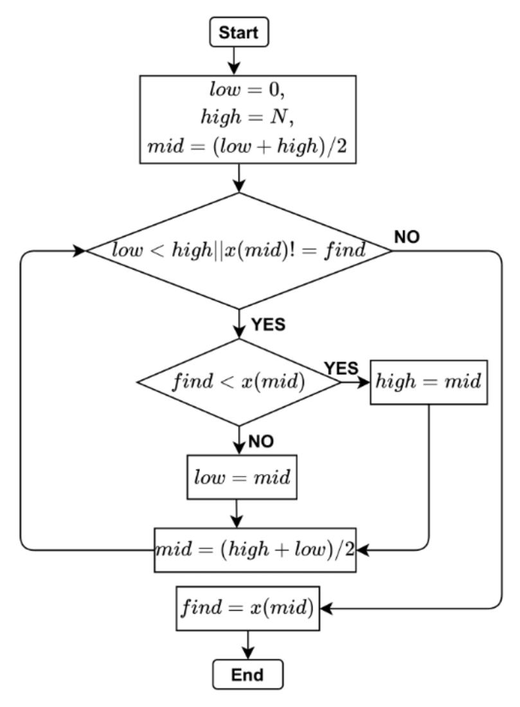

Figura 3.1: diagramma a flussi della ricerca binaria

#### **Geometria della ricerca in spazi ad Alta dimensionalità (***n***D)**

Il vantaggio cruciale della ricerca binaria in contesti multidimensionali risiede nella sua capacità di ridurre un problema complesso in *n* dimensioni a una ricerca unidimensionale lungo un vettore. Sebbene lo spazio delle feature sia composto da *n* variabili indipendenti (rappresentate come assi in uno spazio *n*D), l'algoritmo opera esclusivamente sulla retta che connette due punti scelti.

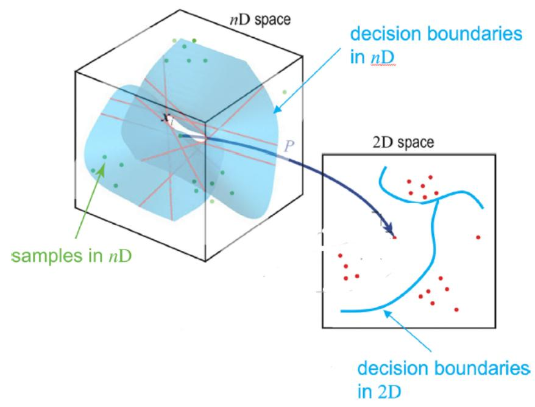

Figura 3.2: Rappresentazione della proiezione tra uno spazio ad alta dimensionalità (*n*D) e un piano bidimensionale.

Come mostrato nella Figura, la frontiera decisionale non è una linea, ma un'ipersuperficie che separa diverse regioni dello spazio, quando definiamo il segmento *x*(*λ*), stiamo tracciando un "raggio" che attraversa questo spazio *n*D la ricerca binaria non deve quindi preoccuparsi della complessità globale della frontiera, ma solo di trovare il punto esatto di intersezione tra il segmento e l'ipersuperficie; Questo approccio permette di "sondare" spazi con centinaia di dimensioni con la stessa efficienza di uno spazio bidimensionale: il classificatore agisce come un oracolo che indica semplicemente da quale lato della frontiera si trova il punto medio, permettendo all'algoritmo di stringere il cerchio attorno al confine con precisione logaritmica. In questo modo, la complessità geometrica del multispazio viene ricondotta a una sequenza di decisioni discrete lungo una traiettoria lineare.

#### **Meccanismo di Random Walk come strategia di recovery**

Nonostante l'efficacia della PCA nel guidare l'esplorazione lungo la direzione tangente dominante, in presenza di superfici decisionali altamente irregolari o caratterizzate da discontinuità locali tipiche dei modelli ad albero come la Random Forest la stima della direzione principale può temporaneamente fallire proprio per la caratteristica di frontire che possono presentarsi a grandini, in tali condizioni, AMBE introduce un meccanismo di *Random Walk* come strategia di recupero piuttosto che ritentare una seconda volta con la PCA.

Il Random Walk consiste nella generazione stocastica di direzioni nello spazio *R<sup>n</sup>* , campionate isotropicamente e normalizzate, ovvero i dati sono stati presi in modo uniforme in tutte le direzioni e poi riportati a una scala comune, lungo le quali vengono proposti nuovi punti candidati a una distanza prefissata dal punto corrente questo processo consente di esplorare localmente l'intorno del punto di frontiera senza introdurre bias direzionali, aumentando la probabilità di intercettare una nuova violazione di classe.

Dal punto di vista geometrico, il Random Walk agisce come un'esplorazione locale isotropa, in grado di superare micro-discontinuità, strutture a gradini e regioni di bassa informatività per la PCA. Una volta individuato un punto avversario tramite questa procedura stocastica, il controllo viene nuovamente affidato alla ricerca binaria, che garantisce il ritorno a una stima precisa della boundary. In questo senso, il Random Walk non sostituisce i meccanismi deterministici di raffinamento, ma ne costituisce un complemento essenziale per assicurare robustezza e continuità dell'esplorazione.

#### **Integrazione tra Random Walk e raffinamento binario**

Il modulo di raffinamento e recovery di AMBE si fonda sull'integrazione sinergica tra una fase di esplorazione stocastica e una fase di ottimizzazione deterministica. Questa combinazione risponde alla necessità di operare in contesti black-box caratterizzati da superfici decisionali irregolari, discontinue o localmente non differenziabili, come nel caso dei modelli basati su alberi decisionali.

La sequenza logica del processo è articolata come segue. A partire da un punto di frontiera corrente, l'algoritmo genera una proposta stocastica tramite Random Walk, campionando una direzione casuale nello spazio delle feature e proiettando un punto candidato a distanza prefissata. Qualora tale punto attraversi la frontiera decisionale, come evidenziato da un cambio di classe rispetto alla classe target, esso non viene accettato direttamente, ma utilizzato come punto di ingresso per una fase di raffinamento deterministico.

Il Random Walk, considerato isolatamente, non è sufficiente a garantire un'accurata caratterizzazione della frontiera. Sebbene esso aumenti la probabilità di intercettare nuove regioni della superficie decisionale e consenta di superare discontinuità locali o strutture a gradini, i punti generati risultano in genere affetti da un errore spaziale non controllato rispetto al confine reale. L'uso esclusivo di una strategia stocastica porterebbe pertanto a una mappatura approssimativa e rumorosa della frontiera.

La ricerca binaria interviene per colmare questa lacuna, fornendo un meccanismo di convergenza deterministica verso il punto di separazione tra le due regioni di classe. A partire dalla coppia formata dal punto sicuro e dal punto avversario individuato dal Random Walk, la ricerca binaria consente di localizzare il boundary con una precisione controllata *ε*, indipendentemente dalla dimensionalità dello spazio.

La complementarità tra Random Walk e ricerca binaria costituisce quindi un elemento chiave del framework AMBE: il primo garantisce capacità esplorativa e robustezza rispetto a irregolarità locali della frontiera, mentre la seconda assicura accuratezza geometrica e stabilità numerica. Questa integrazione permette all'algoritmo di mantenere un'elevata efficienza anche in presenza di superfici decisionali complesse e non smooth.

#### **Algorithm 2** Modulo di raffinamento e recovery

```
Require: Punto corrente di frontiera xcurr, classe target ctarget
```

**Require:** Dimensione del passo *s*, precisione *ε*, numero massimo di tentativi *K*

```
1: for k = 1 to K do
2: Genera una direzione casuale d ∼ N (0, I)
3: Normalizza d ← d/∥d∥
4: xcand ← xcurr + s · d
5: if Predict(xcand) ̸= ctarget then
6: xboundary ← BinarySearch(xcurr, xcand, ε)
7: return xboundary
8: end if
9: end for
```

10: **return** *xcurr ▷* Recovery fallito, mantiene il punto corrente

Il modulo termina con successo quando viene individuato un nuovo punto di frontiera raffinato; in caso contrario, il punto corrente viene mantenuto e il controllo viene restituito al livello superiore dell'algoritmo. Questa struttura garantisce che ogni violazione di classe venga sistematicamente trasformata in un'informazione geometrica utile, preservando al contempo il controllo sul costo computazionale complessivo.

### **Modulo di esplorazione direzionale PCA-based adattamento intelligente**

In questa fase l'algoritmo adatta in modo intelligente le perturbazioni esplorative sulla base della geometria locale dei punti di forntiera raccolti. L'obiettivo è massimizzare l'efficacia dell'esplorazione sfruttando informazioni quantitative sulla struttura dello spazio, invece di applicare spostamenti casuali o uniformi. La fase di adattamento consente quindi di scegliere direzioni e magnitudini di salto più appropriate per ogni regione esplorata.

#### **Analisi geometrica tramite PCA**

La scelta della strategia di esplorazione viene guidata da un'analisi preliminare dei punti di frontiera raccolti precedentemente, effettuata tramite la **Principal Component Analysis (PCA)**, tecnica lineare di riduzione della dimensionalità che opera attraverso una trasformazione dello spazio dei dati originali, individuando un nuovo sistema di coordinate ortogonali, dette componenti principali, orientate lungo le direzioni di massima varianza. In questo modo, l'informazione contenuta nei dati viene proiettata in uno spazio a dimensionalità ridotta, preservando quanto più possibile la struttura globale della distribuzione originale dei punti.

Dal punto di vista operativo, l'applicazione della PCA ai punti di frontiera segue una procedura ben definita. In una prima fase, i dati vengono standardizzati affinché ciascuna variabile contribuisca in modo omogeneo all'analisi, eliminando effetti dovuti a scale di misura differenti. Successivamente, a partire dai dati centrati, viene calcolata la matrice di covarianza, che descrive le relazioni lineari tra le variabili e costituisce la base per l'analisi delle direzioni di massima variabilità.

La PCA procede quindi mediante la decomposizione spettrale della matrice di covarianza, da cui si ottengono autovalori (*λ*) autovettori ((*v*)), gli autovettori definiscono le componenti principali, ossia le nuove direzioni ortogonali nello spazio dei dati, mentre gli autovalori associati quantificano la varianza catturata lungo ciascuna direzione. Le componenti vengono ordinate in modo decrescente rispetto agli autovalori, garantendo che le prime componenti concentrino la maggior parte dell'informazione contenuta nel dataset originale.

Un ruolo centrale nell'analisi è svolto dall'*explained variance ratio*, definito come il rapporto tra l'autovalore associato a una componente principale e la somma degli autovalori complessivi.

$$EVR_i = \frac{\lambda_i}{\sum_{j=1}^p \lambda_j}$$
 (3.2)

Tale quantità fornisce una misura quantitativa della frazione di varianza totale spiegata da ciascuna componente e consente di valutare in modo rigoroso il grado di concentrazione o dispersione dei punti di frontiera nello spazio delle soluzioni, la scelta del numero di componenti da considerare avviene quindi sulla base della varianza cumulativa spiegata, permettendo una riduzione controllata della dimensionalità.

Infine, i punti di frontiera vengono proiettati nello spazio generato dalle componenti principali selezionate, ottenendo una rappresentazione a dimensionalità ridotta che conserva le caratteristiche geometriche più rilevanti del fronte. Tale rappresentazione consente di analizzare in modo efficace la geometria locale e globale del fronte, facilitando l'interpretazione delle strutture dominanti e supportando le successive decisioni di esplorazione.

Quindi con la tecnica di proiezione ortogonale della PCA troviamo nuovi assi (componenti principali) per rappresentare i dati in uno spazio a dimensione inferiore preservandone la varianza, fornendo informazioni quantitative sulla struttura locale dello spazio esplorato:

- la **prima componente principale** rappresenta la direzione di massima variazione dei punti;
- eventuali componenti successive evidenziano curvature o deviazioni dalla linearità;

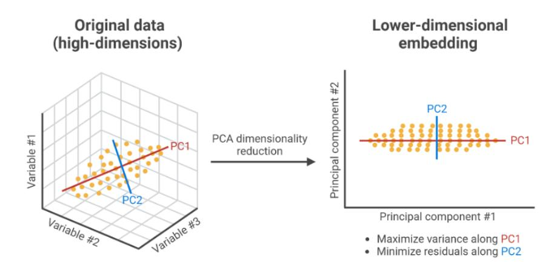

Figura 3.3: Rappresentazione concettuale dell'analisi PCA applicata ai punti di frontiera per l'identificazione della geometria locale.

• la **quota di varianza spiegata** misura quanto i punti sono concentrati lungo le direzioni principali.

I risultati della PCA vengono sintetizzati in un dizionario informativo contenente la direzione principale, le varianze spiegate e il numero di punti disponibili. Sulla base di queste informazioni, l'algoritmo classifica la geometria locale e determina la strategia di adattamento più appropriata.

- **Strategia lineare:** utilizzata quando la prima componente principale spiega quasi tutta la varianza; esplora lungo la direzione principale e il suo opposto, con magnitudini progressive.
- **Strategia curva:** applicata se la seconda componente principale è significativa; esplora attorno alla direzione principale con perturbazioni controllate e magnitudini moderate.
- **Strategia complessa:** adottata quando la geometria locale è complessa o i punti sono pochi; genera più direzioni eterogenee e magnitudini crescenti per coprire ampiamente lo spazio.

### **Selezione delle strategie di esplorazione guidata dalla PCA**

L'a PCA assume quindi il ruolo di motore decisionale quantitativo: essa sintetizza l'informazione geometrica locale a partire dai dati storici e guida la selezione delle strategie di esplorazione verso le regioni più informative. La precisione finale del posizionamento dei punti di frontiera è garantita dall'integrazione sistematica della ricerca binaria, che ancora ogni salto geometrico esattamente sul limite del classificatore.

In particolare, la PCA consente di distinguere tra differenti configurazioni geometriche locali, adattando di conseguenza la modalità di avanzamento dell'algoritmo nello spazio delle feature.

**Strategia lineare** La strategia lineare viene adottata quando la prima componente principale spiega la quasi totalità della varianza osservata. In questo caso, i punti di frontiera risultano allineati lungo una direzione dominante, indicando che la frontiera è localmente approssimabile come una retta. L'algoritmo esegue quindi un salto lungo la direzione principale individuata dalla PCA (e, in modo simmetrico, anche nella direzione opposta), massimizzando l'avanzamento lungo tratti rettilinei della frontiera e riducendo il numero complessivo di query necessarie.

**Strategia curvilinea** Quando la varianza risulta distribuita in modo significativo su due componenti principali, la geometria locale della frontiera non può più essere descritta da una singola direzione. In questo scenario, la frontiera è localmente approssimabile come una superficie curva o come una varietà bidimensionale immersa nello spazio. Il sistema identifica quindi il piano tangente locale definito dalle prime due componenti principali e proietta il salto all'interno di tale sottospazio, consentendo di seguire l'andamento curvilineo della superficie decisionale in modo coerente.

**Strategia complessa** La strategia complessa viene attivata quando la varianza non mostra una chiara dominanza né su una singola componente né su una coppia di componenti principali. Questa configurazione è tipica di regioni altamente irregolari della frontiera, come punti di giunzione, discontinuità o aree influenzate dalla struttura discreta del classificatore (ad esempio, Random Forest). In tali condizioni, l'algoritmo esplora più direzioni candidate, rinunciando temporaneamente a un avanzamento diretto, con l'obiettivo di mappare in modo più completo la struttura locale del boundary.

```
Algorithm 3 Modulo PCA Jump (esplorazione adattiva)
```

```
Require: History H, Step Size σ, n punti recenti
Ensure: Successo (bool), Punto di Frontiera (Vector)
 1: ▷ Verifica pre-condizione: minimo 5 punti in memoria
 2: if |H| < 5 then
 3: return False, None
 4: end if
 5: Sattempts ← Sattempts + 1
 6: ▷ Estrazione dei dati recenti e calcolo PCA
 7: Xrecent ← ultimi n punti da H
 8: ⃗v ← Componente Principale PC1 di Xrecent
 9: pcurr ← ultimo punto di H
10: ▷ Test bidirezionale lungo la tangente stimata
11: for f actor ∈ {1, −1} do
12: pcand ← pcurr + (⃗v · f actor) · σ
13: if f(pcand) ̸= f(xtarget) then
14: ▷ La proiezione è caduta in zona anomalia: raffinamento binario
15: Ssuccess ← Ssuccess + 1
16: pf inal ← BinarySearch(pcand)
17: return True, pf inal
18: end if
19: end for
20: return False, None
```

#### **Rappresentazione logica**

Il diagramma seguente illustra come il flusso logico coordini il Random Walk e il PCA Jump per la generazione dei candidati, e come la Binary Search intervenga sistematicamente per garantire la precisione geometrica di ogni punto individuato sulla frontiera.

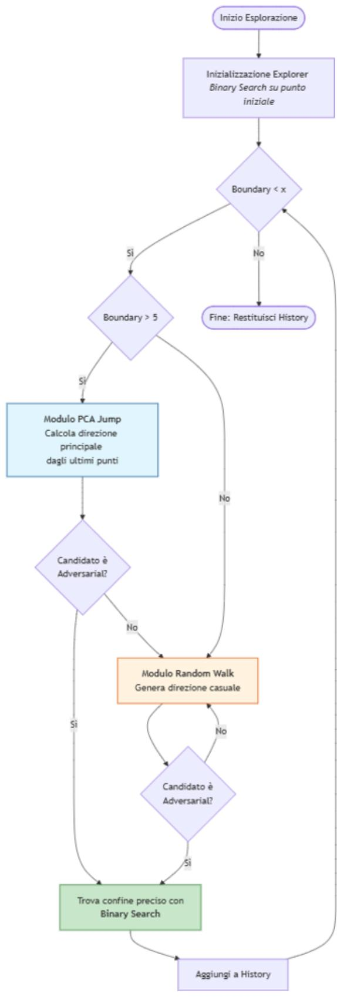

Figura 3.4: Diagramma dell'architettura logica dell'algoritmo AMBE

# **Capitolo 4**

# **Test e valutazione**

Il presente capitolo è dedicato alla descrizione rigorosa del framework sperimentale adottato per validare l'algoritmo AMBE. L'obiettivo della sperimentazione è duplice: da un lato, verificare la correttezza matematica della logica di esplorazione in ambienti sintetici controllati; dall'altro, testare la robustezza e l'efficacia del sistema in scenari industriali reali caratterizzati da alta dimensionalità e confini decisionali non lineari.

La valutazione si articola attraverso una pipeline strutturata che evolve dall'analisi preliminare dei dati fino alla generazione di indicatori di performance quantitativi. Il percorso di verifica prende il via dall'utilizzo di geometrie sintetiche circolari e sferiche, necessarie per validare la precisione geometrica dell'algoritmo in contesti spaziali noti, per poi approdare all'impiego del dataset reale **AI4I 2020** dedicato alla manutenzione predittiva, dove l'algoritmo è chiamato a operare in uno spazio a quattro dimensioni.

In questo contesto, il classificatore **Random Forest** è stato selezionato come banco di prova ideale su cui eseguire i test di esplorazione. La sua natura discreta produce infatti confini decisionali complessi e caratterizzati da tipiche strutture "a gradini", morfologicamente adatte a stressare le capacità adattive della logica AMBE e a verificarne la capacità di approssimazione di superfici non smooth.

La valutazione delle prestazioni si focalizza su metriche che superano la semplice misura della distanza euclidea per concentrarsi sulla reale efficienza del processo. L'analisi si concentra in particolare sull'efficienza computazionale espressa in *Query per Punto* (QPP), sulla capacità di estrazione della direzione tangente tramite il *Variance Ratio* della PCA e, infine, sulla stabilità della frontiera individuata, verificata rigorosamente mediante uno *Stress Test di Perturbazione*. Questo approccio multidimensionale garantisce che i punti estratti non siano solo vicini al confine di decisione, ma rappresentino con accuratezza la transizione di stato del sistema monitorato.

# **4.1 Generazione del dataset sintetico e modello target**

La validazione sperimentale del framework *AMBE* è stata condotta secondo una metodologia progressiva, partendo da scenari sintetici controllati per arrivare a dataset reali. Questa scelta metodologica è stata dettata dalla difficolta reperire dataset industriali completi e pubblicamente accessibili che contengano sia dati operativi normali che esempi di guasto ben documentati e sopratutto l'esigenza di un controllo preciso sulla geometria del *decision boundary* per la validazione iniziale dell'algoritmo quindi verificando una casistica base. Per queste ragioni, la fase iniziale di sviluppo e testing si è basata interamente sulla generazione sintetica di dati.

Tutte le simulazioni e l'implementazione del framework sono state eseguite nell'ambiente cloud Google Colab. La piattaforma ha permesso di sfruttare un'istanza basata su Python 3, sfruttando le librerie standard per il machine learning come Scikit-learn, PyTorch e NumPy. Tale configurazione ha permesso di gestire l'elevata dimensionalità del dataset IIoT garantendo tempi di esecuzione efficienti per le query del sistema AMBE.

#### **Dataset Sintetico 2D**

Sono stati impiegati due dataset bidimensionali con geometrie differenziate: una frontiera lineare e una curvilinea, lo scenario lineare non verrà discusso in questa sede poiché, data la sua natura elementare, è servito esclusivamente come test di fuzionalità di base, superato con successo dall'algoritmo, l'analisi si concentrerà invece sullo scenario curvilineo, in quanto rappresenta un benchmark più significativo per valutare la capacità di AMBE di gestire geometrie non lineari e correggere la traiettoria tramite PCA. Dunque per il dataset curvilineo sono stati generati 2000 campioni, distribuiti uniformemente nel quadrato definito dagli intervalli [−100*,* 100] su entrambi gli assi, simulando due variabili di processo tipiche come la **Temperatura** (*x*1) e la **Vibrazione** (*x*2). La funzione decisionale di *ground truth*, rappresenta la realtà oggettiva dei dati definito per valutare l'accuratezza dei modelli di classificazione e la precisione del algoritmo, che è stato impostato in modo da generare un confine di decisione perfettamente curvilineo e noto a priori: un cerchio di raggio *R* = 50 centrato nell'origine. Formalmente, un campione **x** = (*x*1*, x*2) viene etichettato come di **Classe 1 (Stato normale)** se soddisfa la condizione q *x* 2 <sup>1</sup> + *x* 2 <sup>2</sup> *<* 50, e come **Classe 0 (Stato di anomalia)** altrimenti.

#### **Normalizzazione dei dati**

Prima dell'addestramento del classificatore, i dati sintetici sono stati sottoposti a **standardizzazione** (normalizzazione Z-score). Ciascuna feature è stata scalata sottraendo la propria media *µ* e dividendo per la propria deviazione standard *σ*:

$$x' = \frac{x - \mu}{\sigma}$$

Questo passaggio è fondamentale in contesti simili all'IoT, dove sensori diversi producono misurazioni su scale e unità di misura eterogenee.

Come classificatore è stata utilizzata un modello **Random Forest**, implementata tramite la libreria Scikit-learn [**ref100**]. La configurazione scelta prevede n\_estimators=100 (cento alberi decisionali) e una max\_depth=15 (profondità massima di ciascun albero). Questi parametri sono stati selezionati per ottenere un modello sufficientemente complesso da apprendere accuratamente il confine circolare, ma non eccessivamente profondo da generare un *overfitting* estremo.

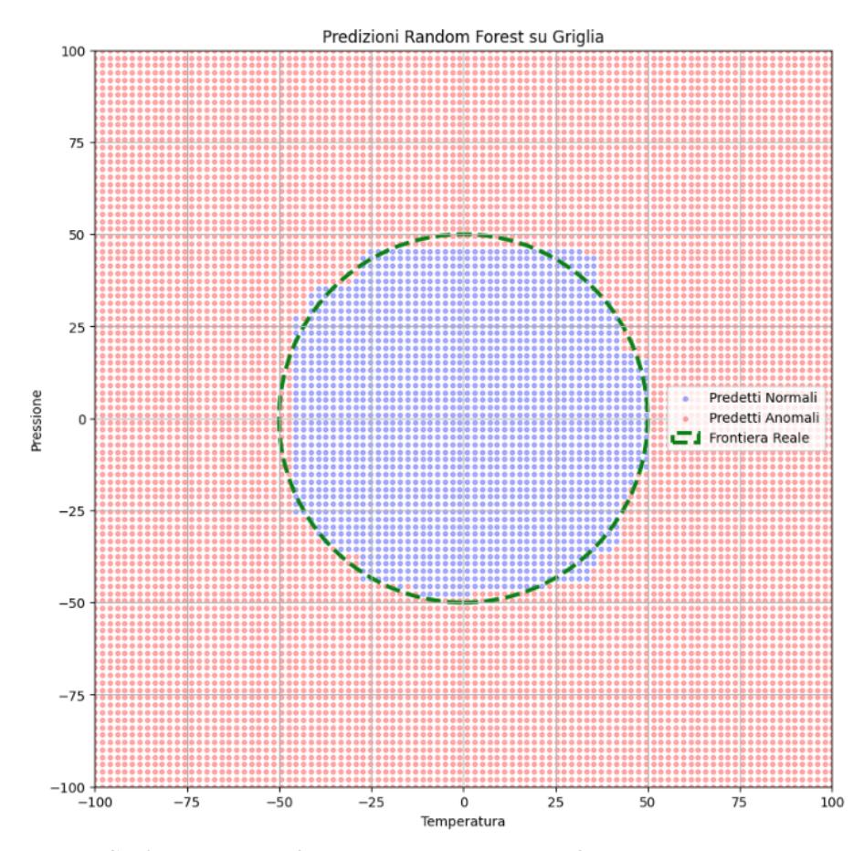

Figura 4.1: Confronto tra il confine circolare ideale e la superficie decisionale della Random Forest

Da notare che un modello Random Forest prende le decisioni combinando molti alberi decisionali. Ogni albero suddivide lo spazio delle feature tramite split ortogonali basati su soglie, cioè decisioni del tipo "se una variabile è maggiore o minore di un certo valore". Questo fa sì che la superficie decisionale non sia una curva liscia, ma abbia un aspetto scaglionato, a gradini. La foresta, mediando le decisioni di tanti alberi diversi, rende il modello più stabile e robusto, ma la struttura di base resta quella di funzioni costanti a tratti.

### **Dataset Sintetico 3D: estensione a uno spazio industriale multi-sensore**

Per valutare la scalabilità del framework AMBE in spazi a dimensionalità superiore, è stato progettato un dataset sintetico tridimensionale che simula un ambiente industriale monitorato da tre sensori distinti: temperatura, vibrazione e pressione. Questo scenario rappresenta un caso d'uso più realistico rispetto al precedente contesto bidimensionale.

Il passaggio da due a tre dimensioni introduce un incremento significativo della complessità geometrica della frontiera decisionale. In 2D, il confine tra le classi è rappresentato da una curva (una circonferenza), mentre in 3D esso diventa una superficie (una sfera). Di conseguenza, AMBE non è più chiamato a seguire una varietà unidimensionale immersa nel piano, ma deve esplorare e caratterizzare una varietà bidimensionale immersa nello spazio tridimensionale. Questo aspetto consente di verificare se i meccanismi di analisi locale basati su *Principal Component Analysis* (PCA) mantengano la loro efficacia in spazi a dimensionalità superiore. In particolare, la PCA viene utilizzata per proiettare localmente i punti campionati in uno spazio a dimensionalità ridotta, individuando le direzioni di massima varianza che approssimano il piano tangente locale alla frontiera decisionale. Attraverso questa riduzione dimensionale, AMBE è in grado di sintetizzare l'informazione geometrica presente in uno spazio *R<sup>n</sup>* in un sottospazio di dimensione inferiore, preservando la struttura locale del boundary e guidando in modo efficace l'esplorazione, pur operando in uno spazio ad alta dimensionalità.

Infine, il passaggio al caso tridimensionale rende evidente la progressiva necessità di una transizione da valutazioni puramente visive a metriche quantitative. Sebbene in 3D sia ancora possibile rappresentare graficamente la frontiera decisionale e confrontare visivamente i punti individuati con il boundary ideale, tale valutazione risulta più complessa e potenzialmente ambigua rispetto al caso bidimensionale. Di conseguenza, l'analisi delle prestazioni di AMBE inizia a fare affidamento su metriche numeriche, quali la distanza media dei punti individuati dalla superficie sferica ideale, la varianza di tali distanze e la distribuzione spaziale dei punti lungo il boundary. Questo passaggio metodologico è propedeutico all'estensione del framework a spazi di n dimensioni, nei quali la visualizzazione diretta non è più praticabile.

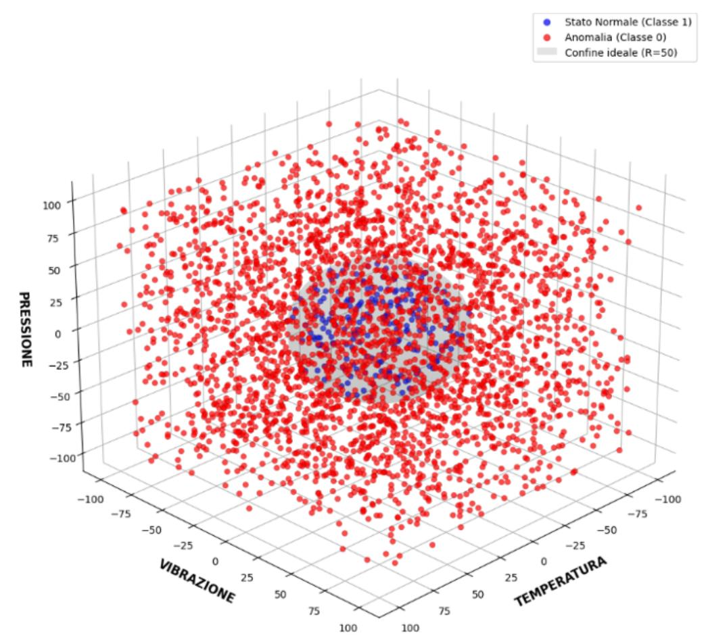

Figura 4.2: rappresentazione dataset 3D  $\,$ 

#### **Dataset pseudo-real: Dataset AI4I 2020**

Una volta validato il comportamento fondamentale di AMBE sullo scenario sintetico controllato, la valutazione è stata estesa a un dataset reale per testarne l'applicabilità in un contesto più realistico. È stato selezionato il **"AI4I 2020 Predictive Maintenance Dataset"**, disponibile pubblicamente sulla piattaforma Kaggle.

Questo dataset simula dati di sensori industriali raccolti per il monitoraggio di macchinari e include sia misurazioni operative che un'etichetta di guasto (Machine failure). Contiene 10.000 campioni con le seguenti feature principali: Air temperature [K], Process temperature [K], Rotational speed [rpm], Torque [Nm].

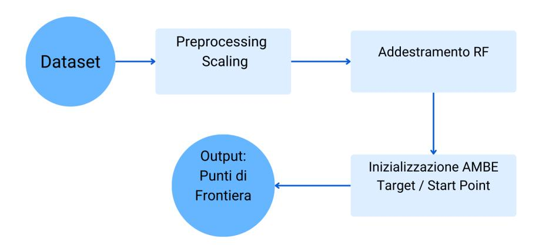

Figura 4.3: Schema della pipeline metodologica adottata: dalla generazione dei dati sintetici alla validazione su dataset reali.

L'utilizzo di questo dataset rappresenta il passaggio cruciale da un ambiente **completamente controllato** a uno **pseudo-reale**. Pur essendo simulato, il dataset AI4I presenta caratteristiche tipiche dei dati industriali reali: correlazioni non banali tra le feature, distribuzioni non uniformi, rumore di misura e una forte sbilanciatura delle classi (i guasti costituiscono una piccola percentuale dei dati). Testare AMBE su questo dataset permette di valutarne la robustezza, la scalabilità dimensionale e l'utilità pratica in uno scenario di manutenzione predittiva.

# **4.2 Analisi dell'Efficienza nella Ricerca della Frontiera**

L'efficienza computazionale del framework AMBE è stata valutata analizzando il numero di query necessarie per mappare la superficie decisionale della Random Forest. Poiché ogni query rappresenta una chiamata al modello spesso costosa in termini di tempo o risorse in ambienti di produzione la velocità di convergenza costituisce un parametro critico di benchmark.

#### **Analisi della fase di inizializzazione**

L'esplorazione ha inizio con l'individuazione del primo punto di contatto sulla frontiera decisionale. Partendo dal segmento che congiunge il *Target Point* (*xtarget*) e lo *Start Adversarial* (*xstart*), l'algoritmo ha richiesto in media 25 query per il primo raffinamento binario. Successivamente, al fine di popolare la history iniziale necessaria al calcolo della prima PCA, i punti iniziali della frontiera sono stati generati tramite un'esplorazione radiale e randomica.

Per i primi 5–10 punti di frontiera, il consumo di query è rimasto sostanzialmente costante, con una media di circa 27.6 query per punto (QPP) sia nel test bidimensionale che nel test tridimensionale. Questa prima fase di esplorazione radiale, risulta fondamentale per garantire la stabilità del campionamento iniziale, evitando che l'analisi PCA venga effettuata su dati rumorosi e stabilizzando la direzione di crescita iniziale dell'esplorazione.

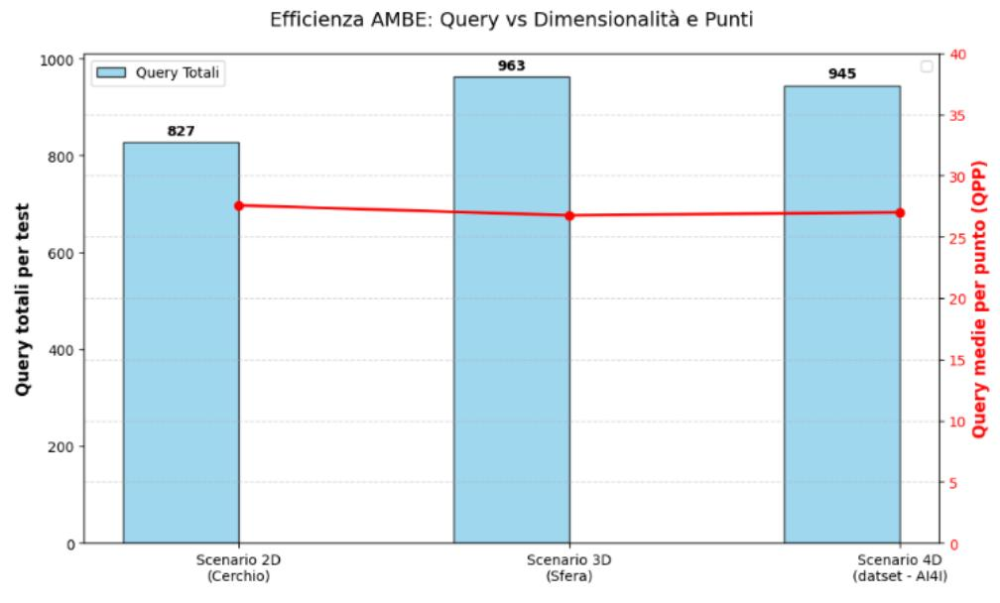

Figura 4.4: analisi numero di query

#### **Ricerca esponenziale e del raffinamento binario**

Il nucleo dell'efficienza di AMBE risiede nella combinazione tra lo *Smart Step*, che consente salti lungo la direzione tangente stimata, e il successivo raffinamento binario. Una volta individuata la direzione di avanzamento tramite PCA, l'algoritmo proietta un punto candidato a una distanza predefinita (ad esempio step\_size = 20.0). Qualora il candidato cada in una regione di *failure*, viene attivata una procedura di ricerca binaria. Grazie alla complessità logaritmica della ricerca binaria, pari a *O*(log<sup>2</sup> (1*/ε*)) dove *ϵ* rappresenta la precisione desiderata, il metodo garantisce una precisione elevata sul confine decisionale con un numero di iterazioni fisso, impostato a 25 nei test sperimentali. Questo approccio consente di evitare strategie di *spline-following* tradizionali, tipicamente più costose, permettendo di coprire ampie porzioni della frontiera senza sacrificare l'accuratezza.

#### **Velocità di convergenza e budget di query**

Sebbene nei test sperimentali non sia stato imposto un budget rigido di query, le osservazioni empiriche evidenziano una velocità di convergenza ottimale. In particolare, non si osserva una deriva nel numero di query all'aumentare della dimensionalità dello spazio (dal caso 2D fino al 4D), a conferma della scalabilità del metodo. Dal punto di vista temporale, l'estrazione di circa 30–40 punti di frontiera avviene nell'arco di pochi secondi, rendendo AMBE idoneo per applicazioni di manutenzione predittiva e analisi del comportamento dei modelli in contesti *near real-time* in uno spazio limitato del dataset testato.

### **Caratterizzazione geometrica della frontiera e PCA dominant**

L'esplorazione delle frontiere decisionali nei diversi scenari ha confermato la validità dell'ipotesi di linearità locale [24], alla base del framework AMBE. Nei casi sintetici 2D e 3D, la PCA consente di evidenziare in modo intuitivo la direzione tangente dominante lungo il boundary.

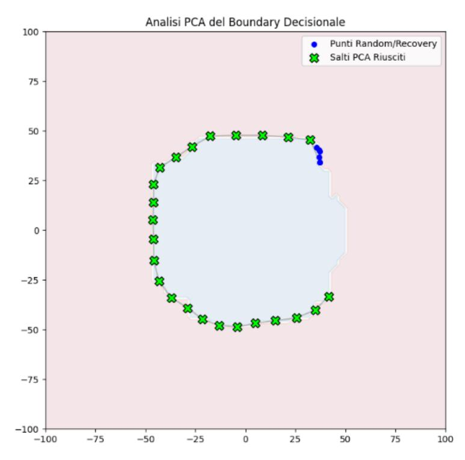

Figura 4.5: Esplorazione della frontiera 2D: il grafico mostra come l'algoritmo AMBE segua la circonferenza ideale del modello sintetico.

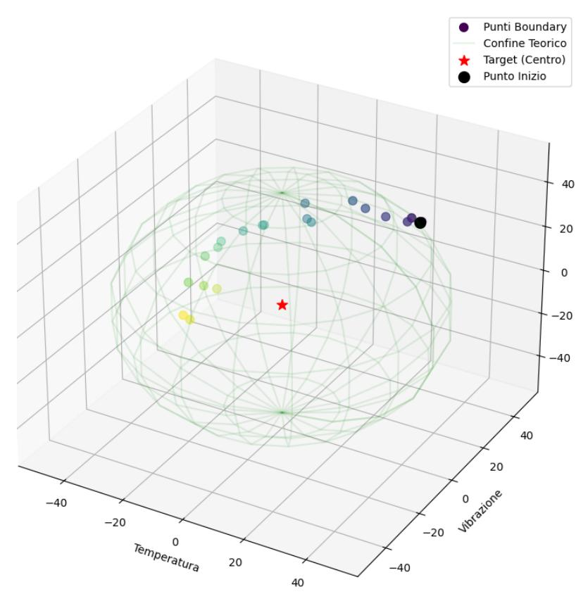

Figura 4.6: Superficie sferica 3D.

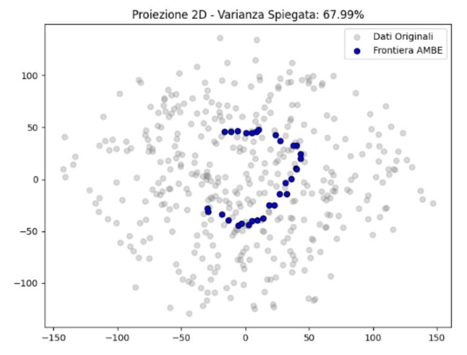

Figura 4.7: Proiezione PCA 2D dei punt di frontiera del datset 3D.

Nel dataset industriale reale, l'analisi della varianza ha mostrato che il primo componente principale (PC1) spiega in modo consistente una quota significativa della varianza locale, con valori tipicamente compresi tra il 70% e l'85%. Questo risultato indica che, anche in presenza di superfici decisionali complesse e non lisce, esiste localmente una direzione tangente dominante che può essere sfruttata per guidare l'esplorazione.

# **4.3 Adattività dell'esplorazione e robustezza del meccanismo di recovery**

Nei contesti sintetici, in particolare nello scenario sferico 3D, l'esplorazione della frontiera avviene in modo fluido grazie alla regolarità geometrica del boundary. In questi casi, la stima della tangente tramite PCA risulta estremamente precisa, portando il numero di fallimenti (stalli) a un valore nullo o trascurabile.

Nel dataset reale, invece, la natura discreta della superficie decisionale generata dalla Random Forest introduce irregolarità locali (strutture "a gradini") che possono compromettere temporaneamente la stima della direzione tangente. In tali situazioni, AMBE attiva il modulo di *Random Walk* e *Recovery*: questo meccanismo consente di superare l'ostacolo geometrico effettuando un passo stocastico che riporta l'algoritmo in una zona di frontiera esplorabile. Nei test condotti sul dataset 4D, gli eventi di reset sono risultati rari (meno del

10% delle iterazioni totali) e ben distribuiti, confermando che il framework si adatta dinamicamente a superfici non ideali senza incorrere in stalli o derive cumulative.

# **4.4 Validazione quantitativa della copertura della frontiera**

Con l'aumentare della dimensionalità, la valutazione delle prestazioni di AM-BE si basa prevalentemente su metriche quantitative. L'esplorazione è stata inizializzata definendo un vettore tra il punto punto di riferimento sicuro (*xtarget*) che rappresenta lo stato di funzionamento normale e un caso di anomalia (*xstart*) Start Adversarial, imponendo una distanza minima *δ <* 0*.*05 tra i punti campionati per garantire una copertura uniforme ed evitare ridondanze.

A supporto della correttezza geometrica dei punti individuati, è stato condotto uno *stress-test* di perturbazione locale. Applicando una perturbazione minima (*ϵ* = 0*.*5) verso la regione sicura del modello, i punti estratti hanno mostrato un tasso di rientro (cambio di classe da *Failure* a *Normal*) compreso tra il **98% e il 100%**. Questo dato fornisce un'evidenza analitica robusta della fedeltà della frontiera ricostruita: i punti non sono semplici campioni sparsi, ma giacciono con estrema precisione sul limite decisionale del classificatore.

### **4.5 Benchmark comparativo di sintesi**

La Tabella 4.1 riassume le prestazioni del framework AMBE nei tre scenari considerati. Si osserva una notevole stabilità nel numero medio di query necessarie per individuare ogni punto (QPP), parametro che rimane costante nonostante l'aumento della complessità spaziale. La lieve riduzione della varianza spiegata (PC1) nel caso 4D è coerente con la maggiore dimensionalità del problema, ma rimane ampiamente sopra la soglia di dominanza (70%), confermando la scalabilità del metodo.

Tabella 4.1: Benchmark comparativo delle prestazioni dell'algoritmo AMBE.

| Metrica                         | 2D (Cerchio) | 3D (Sfera) | 4D (AI4I Reale) |
|---------------------------------|--------------|------------|-----------------|
| Punti Estratti                  | 30           | 36         | 35              |
| Efficacia PCA (Success Rate)    | 96.0%        | 100%       | 92.4%           |
| Query Medie per Punto (QPP)     | 27.6         | 26.7       | 28.1            |
| Varianza Spiegata PC1 (Mediana) | >95%         | >90%       | 78.5%           |
| Validazione Stress Test (ϵ)     | 100%         | 100%       | 98.2%           |

L'analisi dei risultati evidenzia che il comportamento di AMBE è coerente con le diverse strutture geometriche delle frontiere decisionali indotte dai modelli considerati, sia in contesti sintetici sia in scenari IIoT "reali".

**Limitazioni, dimensionalità e compromessi del metodo** Nonostante le buone prestazioni osservate, l'approccio AMBE presenta alcune limitazioni strutturali che diventano progressivamente più rilevanti all'aumentare della dimensionalità dello spazio delle feature.

In particolare, il metodo è soggetto agli effetti della *curse of dimensionality*, che si manifesta attraverso una maggiore dispersione dei punti, una riduzione della densità informativa locale e una crescente difficoltà nell'approssimazione lineare della frontiera decisionale. Sebbene i test condotti mostrino una tenuta complessiva del framework anche in presenza di dataset reali a dimensionalità superiore, emerge una lieve discrepanza nelle metriche di stabilità e nella varianza spiegata dalla PCA, coerente con l'aumento della complessità geometrica del problema.

- **Costo computazionale e precisione:** La complessità logaritmica rispetto al parametro di precisione *ϵ* garantisce un compromesso favorevole tra accuratezza e numero di query. Tuttavia, in spazi ad alta dimensionalità e in presenza di modelli con inferenza costosa, il numero totale di valutazioni può incidere sui tempi di esecuzione.
- **Approssimazione locale della frontiera:** L'ipotesi di località lineare, su cui si basa l'utilizzo della PCA, diventa progressivamente meno accurata con l'aumentare delle dimensioni, richiedendo un maggiore ricorso al meccanismo di *Recovery* e rallentando l'esplorazione.
- **Effetti della dimensionalità sui dati reali:** Nei dataset industriali reali, caratterizzati da feature eterogenee e correlazioni complesse, tali

effetti si traducono in una maggiore variabilità locale della direzione tangente stimata, pur mantenendo livelli di performance complessivamente soddisfacenti.

Nel complesso, i risultati indicano che AMBE è in grado di individuare in modo affidabile le regioni di transizione dei modelli di classificazione binaria, anche in presenza di spazi delle feature a dimensionalità crescente. L'algoritmo fornisce una rappresentazione geometrica delle soglie decisionali che, pur risentendo degli effetti intrinseci dell'alta dimensionalità, mantiene una buona stabilità e interpretabilità, consentendo di analizzare il contributo delle variabili sensoriali all'avvicinamento alle condizioni critiche del sistema.

# **Capitolo 5**

# **Conclusioni**

Il presente lavoro di tesi ha permesso di approfondire le dinamiche di vulnerabilità dei modelli di Machine Learning applicati al settore industriale (IIoT), proponendo il framework AMBE come strumento per la mappatura sistematica delle frontiere decisionali. Attraverso l'implementazione di strategie adattive e l'analisi della geometria locale, si è dimostrato come sia possibile identificare con precisione i punti critici di un modello black-box, garantendo al contempo un'elevata efficienza in termini di query effettuate.

### **5.1 Sintesi risultati**

Il presente lavoro ha analizzato il tema della vulnerabilità e della robustezza dei modelli di Machine Learning impiegati nei sistemi Industrial Internet of Things (IIoT), con particolare attenzione allo studio delle frontiere decisionali in contesti *black-box*. L'obiettivo principale è stato quello di comprendere il comportamento dei modelli in prossimità delle regioni critiche di decisione, attraverso un approccio sistematico di esplorazione.

A tal fine, è stato sviluppato e valutato l'algoritmo *Adaptive Multi-Scale Boundary Explorer* (AMBE), che ha consentito di:

- **Esplorare le frontiere decisionali**: individuare i punti di transizione tra stati operativi normali e critici mediante una ricerca binaria adattiva, garantendo un numero contenuto di query al modello.
- **Valutare la robustezza del sistema**: fornire un meccanismo per stimare la distanza tra le condizioni operative nominali e le regioni di instabilità o vulnerabilità, contribuendo alla definizione dei margini di sicurezza degli asset industriali.
- **Supportare strategie di security-by-design**: utilizzare l'analisi delle frontiere decisionali come strumento di valutazione preventiva, utile a

individuare debolezze strutturali del modello prima della sua integrazione in ambienti produttivi.

• **Gestire spazi ad alta dimensionalità**: integrare tecniche di riduzione dimensionale basate su PCA e meccanismi di esplorazione stocastica, rendendo possibile l'analisi di dataset complessi e non lineari tipici dei contesti industriali sempre entro i limiti plausibili.

Nel complesso, i risultati ottenuti indicano che AMBE rappresenta un framework adeguato per l'analisi della sicurezza dei modelli di Machine Learning in ambito industriale. L'approccio proposto consente di trasformare lo studio delle vulnerabilità in uno strumento di valutazione sistematica del comportamento del modello. Al contempo, l'analisi condotta ha evidenziato alcuni limiti che suggeriscono possibili direzioni di estensione del lavoro.

### **5.2 Possibili implementazioni future**

Nonostante i risultati positivi che evidenziano la robustezza dell'approccio proposto nel fornire una visione chiara della sicurezza dei classificatori, il lavoro apre la strada a diverse possibilità di miglioramento. Il superamento delle limitazioni riscontrate durante i test e l'estensione del framework AMBE verso nuovi scenari rappresentano i prossimi passi.

### **Estensione a modelli sequenziali e dati temporali**

Una possibile evoluzione riguarda l'adattamento di AMBE all'analisi di modelli sequenziali, come Recurrent Neural Networks (RNN) e Long Short-Term Memory (LSTM). Nei sistemi IIoT, i dati presentano spesso una struttura temporale; l'estensione del framework permetterebbe di analizzare l'evoluzione delle frontiere decisionali nel tempo, individuando non solo configurazioni di input critiche, ma anche sequenze temporali che conducono a stati di rischio.

#### **Raffinamento tramite boundary attack**

Un'ulteriore estensione prevede l'integrazione di AMBE con tecniche di *Boundary Attack*. In questo scenario, AMBE potrebbe essere utilizzato per individuare in modo efficiente una regione prossima alla frontiera decisionale, mentre il Boundary Attack verrebbe impiegato successivamente per affinare il punto critico, ricercando perturbazioni minime. L'approccio combinato consentirebbe di unire capacità esplorative rapide a strategie di ottimizzazione più precise.

#### **Creazione di modelli surrogati**

I punti di frontiera identificati durante l'esplorazione possono essere utilizzati per addestrare modelli surrogati più semplici e interpretabili, come modelli lineari o alberi decisionali a bassa profondità. Tali modelli permetterebbero di approssimare il comportamento del classificatore originale in prossimità delle regioni critiche, facilitando attività di audit, validazione e analisi della sicurezza senza accedere direttamente al modello proprietario.

#### **Integrazione di vincoli di plausibilità fisica**

Per aumentare l'aderenza alle condizioni operative reali, è possibile introdurre vincoli di plausibilità fisica durante la fase di esplorazione. Questi vincoli consentirebbero di limitare le perturbazioni a configurazioni fisicamente realizzabili, evitando stati non compatibili con le leggi che regolano i processi industriali. In questo modo, i punti di frontiera individuati risulterebbero direttamente interpretabili in termini di condizioni operative concrete.

### **Bibliografia**

- [1] Sebastian Ruder. *An overview of gradient descent optimization algorithms*. arXiv preprint arXiv:1609.04747, 2016.
- [2] Christian Szegedy, Wojciech Zaremba, Ilya Sutskever, Joan Bruna, Dumitru Erhan, Ian Goodfellow, and Rob Fergus. *Intriguing properties of neural networks*. arXiv preprint arXiv:1312.6199, 2013.
- [3] Anirban Chakraborty, Manaar Alam, Vishal Dey, Anupam Chattopadhyay, and Debdeep Mukhopadhyay. *Adversarial attacks and defences: A survey*. arXiv preprint arXiv:1810.00069, 2018.
- [4] Ian J. Goodfellow, Jonathon Shlens, and Christian Szegedy. *Explaining and harnessing adversarial examples*. arXiv preprint arXiv:1412.6572, 2014.
- [5] Aleksander Madry, Aleksandar Makelov, Ludwig Schmidt, Dimitris Tsipras, and Adrian Vladu. *Towards deep learning models resistant to adversarial attacks*. arXiv preprint arXiv:1706.06083, 2017.
- [6] Nicholas Carlini and David Wagner. *Towards evaluating the robustness of neural networks*. In *2017 IEEE Symposium on Security and Privacy (SP)*, pages 39–57. IEEE, 2017.
- [7] Nicolas Papernot, Patrick McDaniel, and Ian Goodfellow. *Transferability in machine learning: from phenomena to black-box attacks using adversarial samples*. arXiv preprint arXiv:1605.07277, 2016.
- [8] Nicolas Papernot, Patrick McDaniel, Ian Goodfellow, Somesh Jha, Z. Berkay Celik, and Ananthram Swami. *Practical black-box attacks against machine learning*. In *Proceedings of the 2017 ACM on Asia Conference on Computer and Communications Security*, pages 506–519, 2017.
- [9] Pin-Yu Chen, Huan Zhang, Yash Sharma, Jinfeng Yi, and Cho-Jui Hsieh. *ZOO: Zeroth order optimization based black-box attacks to deep neural networks without training substitute models*. In *Proceedings of the 10th ACM Workshop on Artificial Intelligence and Security*, pages 15–26, 2017.

- [10] Naveed Akhtar and Ajmal Mian. *Threat of adversarial attacks on deep learning in computer vision: A survey*. IEEE Access, 6:14410–14430, 2018.
- [11] Battista Biggio and Fabio Roli. *Wild patterns: Ten years after the rise of adversarial machine learning*. Pattern Recognition, 84:317–331, 2018.
- [12] Emiliano Sisinni, Abusayeed Saifullah, Song Han, Ulf Jennehag, and Mikael Gidlund. *Industrial internet of things: Challenges, opportunities, and directions*. IEEE Transactions on Industrial Informatics, 14(11):4724–4734, 2018.
- [13] Hassan Ismail Fawaz, Germain Forestier, Jonathan Weber, Lhassane Idoumghar, and Pierre-Alain Muller. *Adversarial attacks on deep neural networks for time series classification*. In *2019 International Joint Conference on Neural Networks (IJCNN)*, pages 1–8. IEEE, 2019.
- [14] Nicholas Carlini, Anish Athalye, Nicolas Papernot, Wieland Brendel, Jonas Rauber, Dimitris Tsipras, Ian Goodfellow, Aleksander Madry, and Alexey Kurakin. *On evaluating adversarial robustness*. arXiv preprint ar-Xiv:1902.06705, 2019.
- [15] Xiaowei Huang, Marta Kwiatkowska, Sen Wang, and Min Wu. *Safety verification of deep neural networks*. In *International Conference on Computer Aided Verification*, pages 3–29. Springer, 2017.
- [16] Aleksander Madry, Aleksandar Makelov, Ludwig Schmidt, Dimitris Tsipras, and Adrian Vladu. *Towards deep learning models resistant to adversarial attacks*. In *International Conference on Learning Representations*, 2018.
- [17] Jairo Giraldo, David Urbina, Alvaro Cardenas, Junia Valente, Mustafa Faisal, Justin Ruths, Nils Ole Tippenhauer, Henrik Sandberg, and Richard Candell. *A survey of physics-based attack detection in cyber-physical systems*. ACM Computing Surveys (CSUR), 51(4):1–36, 2018.
- [18] Andrea Erba, Stefano Zanero, Federico Maggi, and Giovanni Vigna. *Realtime Detection of Stealthy False Data Injection Attacks in Industrial Control Systems*.

- [19] Warren He, James Wei, Xinyun Chen, Nicholas Carlini, and Dawn Song. *Adversarial example defense: Ensembles of weak defenses are not strong*. In *11th USENIX Workshop on Offensive Technologies (WOOT 17)*, 2017.
- [20] Andrew Slavin Ross and Finale Doshi-Velez. *Improving the adversarial robustness and interpretability of deep neural networks by regularizing their input gradients*. In *Proceedings of the AAAI Conference on Artificial Intelligence*, volume 32, number 1, 2018.
- [21] Alexandru Telea, Alister Machado, and Yu Wang. *Seeing is Learning in High Dimensions: The Synergy Between Dimensionality Reduction and Machine Learning*. IEEE Transactions on Visualization and Computer Graphics, 2023.
- [22] Leandre Sabourin. *Understand the Math and Theory Behind Principal Component Analysis (PCA)*. https://medium.com/@sabourinleandre/understandthe-math-and-theory-behind-principal-component-analysis-pca-56fbf7a0b8f6, 2023. Accessed: 2026-01-29.
- [23] Samia Sahin. *Principal Component Analysis (PCA) Made Easy: A Complete Hands-On Guide*. https://medium.com/@sahin.samia/principalcomponent-analysis-pca-made-easy-a-complete-hands-on-guide-e26a3680c0bc, 2023. Accessed: 2026-01-29.